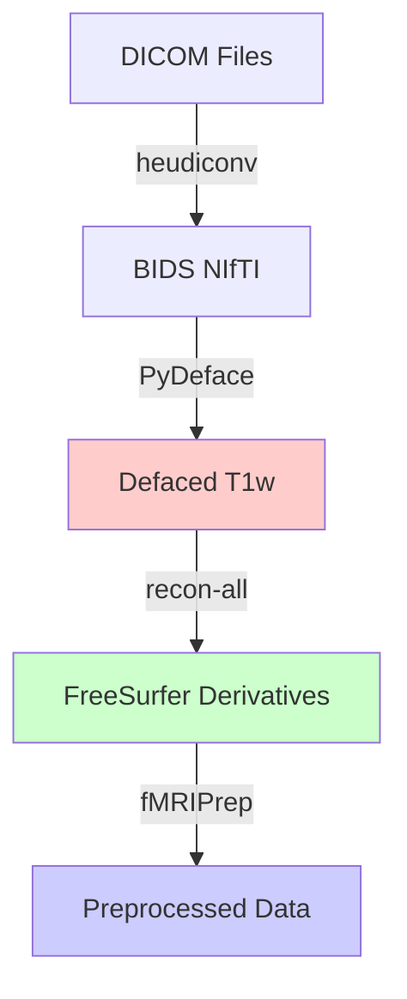

# R01 Preprocessing Workflow

This repository contains scripts for preprocessing neuroimaging data from DICOM format through BIDS conversion, defacing, FreeSurfer reconstruction, and fMRIPrep preprocessing. The workflow ensures that all anatomical derivatives remain defaced throughout the pipeline.

## Overview

The preprocessing pipeline consists of four main steps:

1. **DICOM to NIfTI (BIDS format)** - Convert DICOM files to BIDS-compliant NIfTI format
2. **PyDeface** - Deface anatomical T1w images to protect participant privacy
3. **FreeSurfer recon-all** - Run cortical surface reconstruction on defaced anatomical images
4. **fMRIPrep** - Run preprocessing using FreeSurfer derivatives to maintain defaced anatomical outputs

---

## Prerequisites

- SLURM cluster environment
- Apptainer/Singularity installed
- Required container images:
  - `heudiconv.sif` - For DICOM to BIDS conversion
  - `pydeface.sif` - For defacing anatomical images
  - `freesurfer.sif` - For FreeSurfer reconstruction
  - `fmriprep.sif` - For fMRIPrep preprocessing
- FreeSurfer license file (`fs_license.txt`)
- Heuristic file (`heuristic_reproin_like.py`) for BIDS conversion

## Directory Structure

The workflow expects the following directory structure:

```
/gscratch/scrubbed/fanglab/xiaoqian/IFOCUS/
├── sourcedata/
│   ├── dicom/          # Raw DICOM files (input)
│   │   └── sub-*/      # Subject directories
│   │       └── ses-*/  # Session directories
│   └── nii/            # BIDS-formatted NIfTI files
│       └── sub-*/      # BIDS subject directories
│           └── ses-*/  # BIDS session directories
└── derivatives/
    ├── freesurfer/     # FreeSurfer outputs
    │   └── sub-*/      # FreeSurfer subject directories
    └── fmriprep/       # fMRIPrep outputs
        └── sub-*/      # fMRIPrep subject directories
```

---

## Workflow Steps

### Step 1: DICOM to NIfTI (BIDS Format)

Convert DICOM files to BIDS-compliant NIfTI format using `heudiconv`.

**Script:** `submit_dicom_to_nii.sh`

**What it does:**
- Scans the DICOM directory for all subjects
- Submits a SLURM array job (one job per subject)
- Uses `heudiconv_job.sbatch` to run the conversion
- Applies the heuristic file (`heuristic_reproin_like.py`) to organize files into BIDS structure

**Usage:**
```bash
./submit_dicom_to_nii.sh
```

**Configuration:**
- DICOM root: `/gscratch/scrubbed/fanglab/xiaoqian/IFOCUS/sourcedata/dicom`
- BIDS root: `/gscratch/scrubbed/fanglab/xiaoqian/IFOCUS/sourcedata/nii`
- Heuristic: `heuristic_reproin_like.py`

**Output:**
- BIDS-formatted NIfTI files in the `sourcedata/nii/` directory
- Files organized as: `sub-{subject}/ses-{session}/{datatype}/sub-{subject}_ses-{session}_...nii.gz`

**Logs:**
- Output logs: `logs/heudiconv_<job_id>_<array_id>.out`
- Error logs: `logs/heudiconv_<job_id>_<array_id>.err`

---

### Step 2: PyDeface - Deface Anatomical Images

Deface T1w anatomical images to remove facial features for privacy protection.

**Script:** `submit_pydeface.sh`

**What it does:**
- Finds all T1w images in the BIDS directory
- Skips files that are already defaced (containing `desc-defaced` in filename)
- Creates defaced versions with `_desc-defaced_T1w.nii.gz` suffix
- Preserves original files

**Usage:**
```bash
./submit_pydeface.sh
```

**Configuration:**
- BIDS root: `/gscratch/scrubbed/fanglab/xiaoqian/IFOCUS/sourcedata/nii`
- Container: `/gscratch/scrubbed/fanglab/xiaoqian/containers/pydeface.sif`

**Output:**
- Defaced T1w images: `*_desc-defaced_T1w.nii.gz`
- Original T1w images remain unchanged

**Logs:**
- Output logs: `logs/pydeface_<job_id>_<array_id>.out`
- Error logs: `logs/pydeface_<job_id>_<array_id>.err`

**Note:** The script automatically skips files that are already defaced, so it's safe to re-run.

---

### Step 3: FreeSurfer recon-all

Run FreeSurfer cortical surface reconstruction on the defaced T1w images.

**Script:** `submit_recon.sh`

**What it does:**
- Finds defaced T1w images (`*_desc-defaced_T1w.nii.gz`) for each subject
- Runs `recon-all` with the full pipeline (`-all`)
- Uses parallel processing with 4 OpenMP threads
- Outputs to the FreeSurfer derivatives directory

**Usage:**
```bash
./submit_recon.sh
```

**Configuration:**
- BIDS root: `/gscratch/scrubbed/fanglab/xiaoqian/IFOCUS/sourcedata/nii`
- FreeSurfer derivatives: `/gscratch/scrubbed/fanglab/xiaoqian/IFOCUS/derivatives/freesurfer`
- Container: `/gscratch/scrubbed/fanglab/xiaoqian/containers/freesurfer.sif`
- License: `/gscratch/scrubbed/fanglab/xiaoqian/files/fs_license.txt`

**Output:**
- FreeSurfer subject directories in `derivatives/freesurfer/`
- Each subject directory contains:
  - `mri/` - Volumetric data (T1.mgz, brainmask.mgz, etc.)
  - `surf/` - Surface meshes (lh.white, rh.pial, etc.)
  - `label/` - Cortical labels
  - `scripts/` - Processing logs

**Logs:**
- Output logs: `logs/recon_<job_id>_<array_id>.out`
- Error logs: `logs/recon_<job_id>_<array_id>.err`
- FreeSurfer log: `derivatives/freesurfer/sub-*/scripts/recon-all.log`

**Verification:**

After FreeSurfer completes, verify the outputs:

1. **Check status:**
   ```bash
   ./check_freesurfer_status.sh
   ```
   This generates a CSV report (`freesurfer_status_report.csv`) showing:
   - Completion status for each subject
   - Lock file status
   - Missing required files
   - Recommended actions

2. **Verify defaced input was used:**
   ```bash
   ./verify_freesurfer.sh
   ```
   This checks that the recon-all log confirms the defaced T1w was used as input.

3. **Visual inspection (optional):**
   ```bash
   # With X11 forwarding enabled
   apptainer exec /path/to/freesurfer.sif freeview -v \
     ${DERIVS_DIR}/sub-002/mri/T1.mgz \
     ${DERIVS_DIR}/sub-002/mri/brainmask.mgz:colormap=heat:opacity=0.4
   ```

**Important Notes:**
- The script automatically cleans up lock files from previous runs
- FreeSurfer requires significant time (6-12 hours per subject) and memory (~8-10GB)
- The script uses the defaced T1w images as input, ensuring all derivatives are faceless

---

### Step 4: fMRIPrep Preprocessing

Run fMRIPrep preprocessing using the FreeSurfer derivatives as input to maintain defaced anatomical outputs.

**Script:** `submit_fmriprep.sh`

**What it does:**
- Runs fMRIPrep for each subject
- Uses pre-computed FreeSurfer derivatives (`--fs-subjects-dir`)
- This ensures fMRIPrep uses the defaced FreeSurfer outputs instead of re-running anatomical preprocessing
- Processes both anatomical and functional data

**Usage:**
```bash
./submit_fmriprep.sh
```

**Configuration:**
- BIDS root: `/gscratch/scrubbed/fanglab/xiaoqian/IFOCUS/sourcedata/nii`
- FreeSurfer subjects dir: `/gscratch/scrubbed/fanglab/xiaoqian/IFOCUS/derivatives/freesurfer`
- fMRIPrep output: `/gscratch/scrubbed/fanglab/xiaoqian/IFOCUS/derivatives/fmriprep`
- Work directory: `/gscratch/scrubbed/fanglab/xiaoqian/IFOCUS/work_fmriprep`
- Container: `/gscratch/scrubbed/fanglab/xiaoqian/containers/fmriprep.sif`

**Output:**
- Preprocessed anatomical images: `*_desc-preproc_T1w.nii.gz`
- Preprocessed functional images: `*_desc-preproc_bold.nii.gz`
- Confound regressors: `*_desc-confounds_timeseries.tsv`
- HTML reports: `sub-*.html`
- All outputs in MNI152NLin2009cAsym space (2mm resolution)

**Logs:**
- Output logs: `logs/fmriprep_<job_id>_<array_id>.out`
- Error logs: `logs/fmriprep_<job_id>_<array_id>.err`

**Verification:**

Check fMRIPrep completion status:
```bash
./check_fmriprep_status.sh
```

This generates a CSV report (`fmriprep_status_report.csv`) showing:
- HTML report availability
- Anatomical preprocessing status
- Functional preprocessing status
- Confound file availability
- Overall completion status

**Important Notes:**
- fMRIPrep uses the pre-computed FreeSurfer derivatives, so anatomical outputs remain defaced
- The `--fs-subjects-dir` flag is critical for using the existing FreeSurfer outputs
- Processing time: 12-24 hours per subject
- Memory requirements: 32GB minimum (48-64GB recommended)

---

## Additional Scripts

### Status Checking Scripts

- **`check_freesurfer_status.sh`** - Comprehensive FreeSurfer status report with CSV output
- **`check_fmriprep_status.sh`** - fMRIPrep completion status report with CSV output
- **`verify_freesurfer.sh`** - Quick verification that defaced inputs were used
- **`check_error.sh`** - Check for errors in log files

### Utility Scripts

- **`fix_intended_for.py`** - Fix `IntendedFor` fields in JSON sidecar files
- **`check_miss_pydefaced_sessions.sh`** - Check for sessions missing defaced images
- **`submit_specific_recon.sh`** - Submit FreeSurfer for specific subjects
- **`unzip.sh`** - Utility for unzipping files

---

## Workflow Summary



**Key Points:**
1. All anatomical images are defaced before FreeSurfer
2. FreeSurfer runs on defaced images, ensuring all derivatives are faceless
3. fMRIPrep uses FreeSurfer derivatives, maintaining defaced anatomical outputs
4. Each step can be verified independently using the provided status scripts

---

## Troubleshooting

### FreeSurfer Issues

- **Lock files:** If a job crashes, lock files may prevent restart. The `recon_all.sbatch` script automatically cleans these up.
- **Missing fsaverage:** If the fsaverage template is corrupted, delete it and let fMRIPrep recreate it.
- **Incomplete runs:** Check `recon-all.log` in each subject's `scripts/` directory for error messages.

### fMRIPrep Issues

- **BIDS validation errors:** The script uses `--skip-bids-validation` to handle minor naming issues. Check logs for warnings.
- **Memory errors:** Increase `--mem` in `fmriprep.sbatch` if jobs fail due to memory.
- **FreeSurfer not found:** Ensure `--fs-subjects-dir` points to the correct FreeSurfer derivatives directory.

### General Issues

- **Array job limits:** If you need to throttle array jobs, add `%<number>` to the sbatch command (e.g., `--array=0-10%5`).
- **Container paths:** Verify all container paths are correct and accessible.
- **License file:** Ensure the FreeSurfer license file path is correct and readable.

---

## Notes

- All scripts use SLURM array jobs for parallel processing across subjects
- Logs are stored in the `logs/` directory (created automatically)
- The workflow is designed to be idempotent - re-running steps will skip already-processed files where possible
- Paths in the scripts are hardcoded for the specific cluster environment - update them as needed for your setup

---

## Contact

For questions or issues, please refer to the log files in the `logs/` directory or check the status reports generated by the verification scripts.
