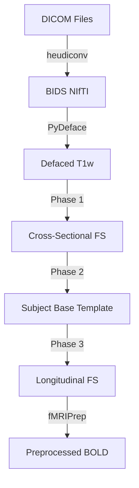

# R01 Preprocessing Workflow

This repository contains scripts for preprocessing neuroimaging data from DICOM format through BIDS conversion, defacing, FreeSurfer reconstruction (longitudinal stream), and fMRIPrep. The workflow ensures all anatomical derivatives remain defaced and anatomically consistent across timepoints.

## Overview

The preprocessing pipeline consists of four main steps:

1. **DICOM to NIfTI (BIDS format)** – Convert DICOMs to BIDS NIfTI using heudiconv
2. **PyDeface** – Deface T1w images for privacy compliance
3. **FreeSurfer Longitudinal Stream** – A three-phase process (Cross-sectional, Base, Longitudinal) to optimize multi-session data
4. **fMRIPrep** – Preprocessing using pre-computed longitudinal FreeSurfer derivatives

## Directory Structure

```
/gscratch/scrubbed/fanglab/xiaoqian/IFOCUS/
├── sourcedata/
│   ├── dicom/          # Raw DICOM files
│   └── nii/            # BIDS NIfTI (sub-*/ses-*/)
└── derivatives/
    ├── freesurfer/     
    │   ├── sub-01_ses-01/               # Phase 1: Cross-sectional
    │   ├── sub-01_base/                 # Phase 2: Subject Template
    │   └── sub-01_ses-01.long.sub-01_base/ # Phase 3: Final Longitudinal
    └── fmriprep/       # fMRIPrep outputs (sub-*/ses-*/)
```

## Workflow Steps

### Step 0: Download Recent DICOM Sessions from Flywheel

Download raw DICOM sessions from Flywheel by session scan date on Hyak.

**Script:** `download_bids_subjects_on_hyak_byTime.sh`

**Usage:**
```bash
# Set your Flywheel API key for the current shell session
export FW_KEY="uw-chn.flywheel.io:YOUR_API_KEY"

# Preview sessions with session.timestamp on or after START_DATE.
# This writes a manifest only; no data are downloaded.
START_DATE=2026-06-22 LIST_ONLY=1 bash download_bids_subjects_on_hyak_byTime.sh

# Download DICOM files into <subject>/<session>/<acquisition>/ folders.
START_DATE=2026-06-22 LIST_ONLY=0 bash download_bids_subjects_on_hyak_byTime.sh
```

**What it does:**
- Finds sessions in `fang-lab/IFOCUS` with `session.timestamp >= START_DATE`
- Writes a manifest such as `/gscratch/fang/IFOCUS/sourcedata/MRI/sessions_since_2026-06-22.csv`
- Downloads DICOM files into `/gscratch/fang/IFOCUS/sourcedata/MRI/<subject>/<session>/<acquisition>/`
- Reuses existing files only when the file size matches Flywheel metadata

**Common options:**
```bash
# Use the older fw download tar workflow. This may be killed by Hyak/Apptainer.
DOWNLOAD_MODE=tar EXTRACT_AFTER=1 KEEP_TARS=1 LIST_ONLY=0 bash download_bids_subjects_on_hyak_byTime.sh

# Change parallel download count. Default is JOBS=1 because Hyak may kill
# multiple concurrent fw download processes inside Apptainer.
JOBS=2 LIST_ONLY=0 bash download_bids_subjects_on_hyak_byTime.sh

# Try explicit CLI login before downloads, only if fw download reports an auth error
RUN_FW_LOGIN=1 LIST_ONLY=0 bash download_bids_subjects_on_hyak_byTime.sh

# Change Flywheel project or destination if needed
PROJECT_PATH="fang-lab/IFOCUS" BIND_SRC="/gscratch/fang/IFOCUS/sourcedata/MRI" bash download_bids_subjects_on_hyak_byTime.sh
```

**Notes:**
- `fw sync --include` filters file types, not dates. This script queries sessions by date first, then downloads the matched sessions.
- If the Apptainer image does not include the Flywheel Python SDK, the script installs `flywheel-sdk` under `/DATA_DIR/.python-userbase`.
- The default `DOWNLOAD_MODE=files` avoids `fw download` because the CLI tar workflow can be killed by Hyak/Apptainer.
- `DOWNLOAD_MODE=tar` skips `fw login` by default because that step can be killed by Hyak/Apptainer squashfuse cleanup; set `RUN_FW_LOGIN=1` only if tar downloads fail with an authentication error.
- Do not commit or paste real Flywheel API keys into scripts or documentation.

### Step 1: DICOM to BIDS Conversion

Convert raw DICOM files to BIDS-compliant NIfTI format using heudiconv.

**Script:** `submit_dicom_to_nii.sh` (wraps `heudiconv_job.sbatch`)

**Usage:**
```bash
# Process all subjects
./submit_dicom_to_nii.sh

# Process specific subject (manual submission)
sbatch --export=ALL,TARGET_SUB="sub-001" heudiconv_job.sbatch

# Process specific subject and session (manual submission)
sbatch --export=ALL,TARGET_SUB="sub-001",TARGET_SES="ses-01" heudiconv_job.sbatch
```

**What it does:**
- Scans the DICOM directory for all subjects
- Submits a job array (one job per subject)
- Uses `heuristic_reproin_like.py` for BIDS conversion
- Outputs to `sourcedata/nii/` in BIDS format

**Note:** The wrapper script `submit_dicom_to_nii.sh` processes all subjects. For specific subjects/sessions, submit `heudiconv_job.sbatch` directly with `--export` flags.

**Configuration:**
- DICOM root: `/gscratch/scrubbed/fanglab/xiaoqian/IFOCUS/sourcedata/dicom`
- Heuristic: `heuristic_reproin_like.py`

### Step 2: PyDeface

Deface T1w anatomical images to remove facial features for privacy compliance.

**Script:** `submit_pydeface.sh` (wraps `pydeface.sbatch`)

**Usage:**
```bash
# Process all subjects
./submit_pydeface.sh

# Process specific subject
./submit_pydeface.sh sub-001

# Process specific subject and session
./submit_pydeface.sh sub-001 ses-01
```

**What it does:**
- Defaces T1w images in BIDS directory
- Creates `*desc-defaced_T1w.nii.gz` files
- Preserves original files (defaced versions replace them in the pipeline)

**Verification:**
```bash
./check_miss_pydefaced_sessions.sh
```

### Step 3: FreeSurfer Longitudinal Stream

For datasets with multiple sessions, use the FreeSurfer longitudinal stream to reduce anatomical noise and prevent processing bias across timepoints.

#### Phase 1: Cross-Sectional

**Script:** `submit_recon.sh` (wraps `recon_all.sbatch`)

**Usage:**
```bash
# Process all sessions
./submit_recon.sh

# Process specific subjects only
./submit_specific_recon.sh
```
Edit the `TARGETS` array in `submit_specific_recon.sh` to specify which subjects to process (e.g., `TARGETS=("sub-130" "sub-326" "sub-330")`).

**What it does:**
- Processes every session independently
- Creates folders named `sub-XXX_ses-YYY`
- Performs standard `recon-all` processing

**Note:** `submit_recon.sh` processes all sessions. Use `submit_specific_recon.sh` for specific subjects only.

#### Phase 2: Subject Base Template

**Script:** `submit_longitudinal.py` (Stage: BASE)

**Usage:**
```bash
# Process all subjects
python submit_longitudinal.py
```

**What it does:**
- Creates an unbiased, subject-specific average template from all available sessions
- Creates `sub-XXX_base` folders
- Automatically submits LONG jobs with dependencies after BASE completes

**Note:** This script processes all subjects automatically. For specific subjects, you can modify the script or submit `long_stage.sbatch` directly:
```bash
# Manual BASE submission for specific subject
sbatch --export=ALL,STAGE=BASE,SUBID="sub-001",TPS="-tp sub-001_ses-01 -tp sub-001_ses-02" long_stage.sbatch
```

#### Phase 3: Longitudinal Run

**Script:** `submit_longitudinal.py` (Stage: LONG)

**Usage:**
```bash
# Process all subjects (automatically submitted after BASE)
python submit_longitudinal.py
```

**What it does:**
- Re-processes each session using the Base template as a seed
- Produces the final derivatives for analysis
- Folders are named `sub-XXX_ses-YYY.long.sub-XXX_base`
- Jobs are automatically submitted with `--dependency=afterok` on the BASE job

**Note:** For specific sessions, submit `long_stage.sbatch` directly:
```bash
# Manual LONG submission for specific session (after BASE completes)
sbatch --dependency=afterok:JOBID --export=ALL,STAGE=LONG,SUBID="sub-001",TP="sub-001_ses-01" long_stage.sbatch
```

**Verification:**
```bash
./check_freesurfer_status.sh
```
This script generates `freesurfer_longitudinal_status.csv` with status for all three phases (CROSS, BASE, LONG).

### Step 4: fMRIPrep Preprocessing

Run fMRIPrep using the Phase 3 Longitudinal derivatives.

**Script:** `submit_fmriprep.sh` (wraps `fmriprep.sbatch`)

**Usage:**
```bash
# Process all sessions
./submit_fmriprep.sh

# Process specific session (manual submission)
# First, find the array index for your session, then:
sbatch --array=INDEX fmriprep.sbatch
```

**What it does:**
- Submits a job array for every session (rather than every subject)
- Uses `--fs-subject-id` to point fMRIPrep specifically to the corresponding `.long` folder in the FreeSurfer directory
- Ensures anatomical consistency across sessions for functional alignment

**Note:** `submit_fmriprep.sh` processes all sessions. For specific sessions, you need to:
1. Find the session's array index by checking the sorted session list
2. Submit `fmriprep.sbatch` directly with `--array=INDEX`

**Verification:**
```bash
./check_fmriprep_status.sh
```
This script generates `fmriprep_status_report.csv` with completion status.

**Critical Note:** This step must only be run after Phase 3 of FreeSurfer is complete for the target session.

## Workflow Summary


```mermaid
graph TD
    A[DICOM Files] -->|heudiconv| B[BIDS NIfTI]
    B -->|PyDeface| C[Defaced T1w]
    C -->|Phase 1| D[Cross-Sectional FS]
    D -->|Phase 2| E[Subject Base Template]
    E -->|Phase 3| F[Longitudinal FS]
    F -->|fMRIPrep| G[Preprocessed BOLD]
```

## Specific Subject/Session Processing

Many scripts support processing specific subjects or sessions. Here's a summary:

| Script | Specific Sub/Ses Support | Method |
|--------|-------------------------|--------|
| `submit_dicom_to_nii.sh` | ⚠️ Manual only | Submit `heudiconv_job.sbatch` directly with `--export=ALL,TARGET_SUB="sub-XXX"` |
| `submit_pydeface.sh` | ✅ Yes | `./submit_pydeface.sh sub-001` or `./submit_pydeface.sh sub-001 ses-01` |
| `submit_recon.sh` | ❌ No | Use `submit_specific_recon.sh` instead |
| `submit_specific_recon.sh` | ✅ Yes | Edit `TARGETS` array in script |
| `submit_longitudinal.py` | ⚠️ Manual only | Submit `long_stage.sbatch` directly with appropriate `--export` flags |
| `submit_fmriprep.sh` | ⚠️ Manual only | Submit `fmriprep.sbatch` directly with `--array=INDEX` |

## Utility Scripts

### Status Checking

- **`check_freesurfer_status.sh`** – Check FreeSurfer processing status for all phases
  - Outputs: `freesurfer_longitudinal_status.csv`
  - Checks for lock files, log completion, and required output files

- **`check_fmriprep_status.sh`** – Check fMRIPrep completion status
  - Outputs: `fmriprep_status_report.csv`
  - Verifies HTML reports, anatomical, functional, and confound outputs

- **`check_miss_pydefaced_sessions.sh`** – List all defaced sessions
  - Shows which subject/session combinations have been defaced

- **`check_error.sh`** – Check for errors in log files (if available)

### Data Management

- **`fix_intended_for.py`** – Fix `IntendedFor` fields in JSON sidecars (if needed)

- **`verify_freesurfer.sh`** – Additional FreeSurfer verification (if available)

- **`unzip.sh`** – Unzip compressed files (if needed)

## Troubleshooting

### Longitudinal Specifics

- **Dependency Issues:** The `submit_longitudinal.py` script uses Slurm dependencies. If the BASE job fails, the LONG jobs will be cancelled automatically.

- **Naming Mismatches:** fMRIPrep requires the `--fs-subject-id` to match the folder name in your FreeSurfer directory exactly. If fMRIPrep fails to find anatomy, check the `FS_LONG_ID` variable in `fmriprep.sbatch`.

- **fsaverage:** If fsaverage is missing from the derivatives folder, the status script will alert you. fMRIPrep or FreeSurfer usually populates this automatically.

### General Cluster Notes

- **Memory:** fMRIPrep is memory-intensive. The script is configured for 48GB; increase to 64GB if processing high-resolution data or many sessions simultaneously.

- **Work Directory:** The `work_fmriprep` directory grows rapidly. Clean up work directories once subjects are verified.

- **Log Files:** Refer to the log files in the `logs/` directory for detailed error messages.

## Configuration

All scripts use hardcoded paths. Update the following variables in each script as needed:

- **BIDS_ROOT:** `/gscratch/scrubbed/fanglab/xiaoqian/IFOCUS/sourcedata/nii`
- **DICOM_ROOT:** `/gscratch/scrubbed/fanglab/xiaoqian/IFOCUS/sourcedata/dicom`
- **DERIVS_DIR:** `/gscratch/scrubbed/fanglab/xiaoqian/IFOCUS/derivatives/`
- **Flywheel download root:** `/gscratch/fang/IFOCUS/sourcedata/MRI`

## Script Files

### Main Workflow Scripts
- `download_bids_subjects_on_hyak_byTime.sh` – Download Flywheel DICOM sessions by session date
- `submit_dicom_to_nii.sh` – DICOM to BIDS conversion
- `submit_pydeface.sh` – Defacing
- `submit_recon.sh` – FreeSurfer cross-sectional
- `submit_specific_recon.sh` – FreeSurfer for specific subjects
- `submit_longitudinal.py` – FreeSurfer longitudinal (BASE and LONG)
- `submit_fmriprep.sh` – fMRIPrep preprocessing

### SBATCH Templates
- `heudiconv_job.sbatch` – DICOM conversion job template
- `pydeface.sbatch` – Defacing job template
- `recon_all.sbatch` – FreeSurfer cross-sectional job template
- `long_stage.sbatch` – FreeSurfer longitudinal job template
- `fmriprep.sbatch` – fMRIPrep job template

### Configuration Files
- `heuristic_reproin_like.py` – Heudiconv heuristic for BIDS conversion
- `pydeface.def` – PyDeface configuration

### Utility Scripts
- `check_freesurfer_status.sh` – FreeSurfer status checker
- `check_fmriprep_status.sh` – fMRIPrep status checker
- `check_miss_pydefaced_sessions.sh` – Defacing status checker
- `check_error.sh` – Error log checker
- `fix_intended_for.py` – Fix JSON sidecars
- `verify_freesurfer.sh` – FreeSurfer verification
- `unzip.sh` – File extraction utility
